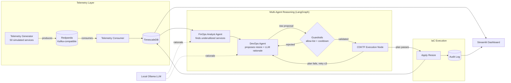

# 🤖 Autonomous Multi-Agent FinOps & Cloud Infrastructure Optimizer

**A self-correcting, multi-agent system that detects underutilized cloud infrastructure, reasons about cost-saving resizes using a local LLM, and safely applies infrastructure-as-code changes — with hard guardrails so the AI can never take an unsafe action.**

[](https://www.python.org/)
[](https://github.com/langchain-ai/langgraph)
[](https://streamlit.io/)
[](https://www.timescale.com/)
[](https://redpanda.com/)
[](https://developer.hashicorp.com/terraform/cdktf)
[](#license)

**🔗 Live demo:** [finops-optimizer.streamlit.app](https://finops-optimizer-32bhoitgxkyk5ejxr64lko.streamlit.app/)

---

## Overview

Cloud bills balloon quietly — a handful of oversized, idle instances can cost a team thousands every month, and manually auditing fleet-wide utilization doesn't scale. This project builds a working, end-to-end simulation of an **autonomous FinOps pipeline**:

1. A telemetry generator simulates **50 microservices** streaming live CPU, memory, and cost metrics through a Kafka-compatible broker into a time-series database.
2. A **two-agent LangGraph workflow** — a FinOps Analyst and a DevOps Agent — reasons over that data with a local Ollama LLM, identifies chronically underutilized services, and proposes right-sized instance downgrades.
3. Every proposal is forced through a **strict Pydantic guardrail layer** before it can touch any infrastructure: hallucinated instance types are rejected, savings estimates are sanity-checked, and a per-service cooldown prevents flapping.
4. Approved proposals are turned into a **CDKTF (Terraform) stack**, plan-checked, and applied — with the option to swap the simulated backend for a real AWS account.
5. A **Streamlit dashboard** shows the whole loop live: fleet cost, per-service CPU, and a full audit trail of every decision the agents made.

The core idea driving the design: **never trust a language model's raw output for anything that touches real infrastructure.** Every agent decision is validated against deterministic rules before execution.

---

## Architecture



**Feedback loop:** once a resize is applied, the telemetry generator picks it up and starts emitting metrics consistent with the new, smaller instance — so the dashboard shows CPU and cost shift in near real time.

---

## ✨ Key Features

| Area | What it does |
|---|---|
| **Multi-agent reasoning** | Two cooperating LangGraph nodes — a FinOps Analyst and a DevOps Agent — with a self-correcting retry loop (up to 3 attempts) when an infrastructure plan fails. |
| **Local LLM reasoning** | Uses a local Ollama model (`llama3:8b` by default) to generate natural-language rationale for each proposal, with a deterministic rule-based fallback if Ollama isn't running. |
| **Hallucination guardrail** | Every proposal is validated against a strict Pydantic schema and a hardcoded instance-type allow-list — an invented type like `t3.ultra-mega` is rejected before it reaches any execution step. |
| **Cooldown guardrail** | A per-service cooldown (default 4 hours) prevents the agents from repeatedly resizing the same service on noisy, short-term traffic spikes. |
| **Plan-before-apply** | Nothing is applied without first passing a `cdktf plan`-equivalent safety check — real Terraform if `CDKTF_REAL=1`, or a deterministic simulated check otherwise. |
| **Live dashboard** | Streamlit UI with auto-refreshing fleet cost metrics, per-service CPU charts, an on-demand "Run Agent Reasoning Cycle" button, and a full audit trail of every analysis/plan/apply/reject decision. |
| **Closed feedback loop** | Applied resizes are picked up by the telemetry generator, which immediately starts simulating the post-resize workload — so you can watch cost and CPU shift live. |
| **Deploy-ready** | Ships with a root-level `requirements.txt`, `Procfile`, and `render.yaml` for one-click deployment on Streamlit Community Cloud or Render. |

---

## 🧰 Tech Stack

- **Language:** Python 3.10+
- **Agent orchestration:** [LangGraph](https://github.com/langchain-ai/langgraph)
- **LLM inference:** [Ollama](https://ollama.com) (local, e.g. `llama3:8b`)
- **Streaming:** [Redpanda](https://redpanda.com/) (Kafka-compatible)
- **Database:** [TimescaleDB](https://www.timescale.com/) (PostgreSQL + time-series), with a SQLite fallback for lightweight/demo deployments
- **Validation:** [Pydantic](https://docs.pydantic.dev/)
- **Infrastructure as Code:** [CDKTF](https://developer.hashicorp.com/terraform/cdktf) (Terraform CDK for Python)
- **Dashboard:** [Streamlit](https://streamlit.io/)
- **Containerization:** Docker Compose (Redpanda + TimescaleDB)

---

## 🚀 Quick Start

### Prerequisites
- Docker + Docker Compose
- Python 3.10+
- (Optional, for real local LLM inference) [Ollama](https://ollama.com)

### 1. Install dependencies
```bash
cd finops-optimizer
python -m venv venv
source venv/bin/activate      # Windows: venv\Scripts\activate
pip install -r requirements.txt
```

### 2. Start infrastructure
```bash
docker compose up -d
```
Wait ~15s for healthchecks, then verify with `docker ps` — `redpanda`, `redpanda-console`, and `timescaledb` should all be healthy. The schema in `db/init.sql` is applied automatically on first boot.

### 3. (Optional) Set up the local LLM
```bash
ollama pull llama3:8b
ollama serve
```
> If skipped, the pipeline still runs end-to-end using a deterministic rule-based fallback for agent rationale.

### 4. Start the telemetry stream
```bash
# Terminal A — producer
python telemetry/telemetry_generator.py

# Terminal B — consumer
python telemetry/telemetry_consumer.py
```

### 5. Run one multi-agent reasoning cycle
```bash
python agents/agent_graph.py
```

### 6. Launch the dashboard
```bash
streamlit run dashboard/dashboard.py
```
Open **http://localhost:8501** to watch live fleet metrics, trigger reasoning cycles on demand, and inspect the full agent audit trail.

Full step-by-step setup notes (including common issues and how to swap in real AWS/CDKTF) live in [`finops-optimizer/README.md`](finops-optimizer/README.md).

---

## 📁 Project Structure

```
Finops-optimizer/
├── finops-optimizer/
│   ├── docker-compose.yml        # Redpanda + TimescaleDB
│   ├── db/
│   │   ├── init.sql              # Schema: telemetry, audit log, cooldown table
│   │   └── db_helper.py          # DB connection + SQL dialect translation
│   ├── telemetry/
│   │   ├── telemetry_generator.py  # Simulates 50 services -> Kafka topic
│   │   ├── telemetry_consumer.py   # Kafka topic -> TimescaleDB
│   │   └── kafka_mock.py           # In-memory Kafka mock for demo deployments
│   ├── agents/
│   │   ├── agent_graph.py        # LangGraph: FinOps Analyst + DevOps Agent
│   │   └── guardrails.py         # Pydantic allow-list + cooldown enforcement
│   ├── sandbox/
│   │   ├── cdktf_runner.py       # Writes CDKTF stack, simulates plan/apply
│   │   └── applied_resizes.json  # Shared state the telemetry generator reacts to
│   ├── dashboard/
│   │   └── dashboard.py          # Streamlit live view + audit trail
│   └── requirements.txt
├── requirements.txt               # Root requirements for deployment platforms
├── Procfile                        # Process definition for Heroku-style platforms
├── render.yaml                     # Render.com deployment config
└── .devcontainer/                  # VS Code / Codespaces dev container
```

---

## 🛡️ How the Safety Guardrails Work

This is the core design principle of the project: **the LLM's raw output is never trusted for anything destructive.**

- **Hallucination guardrail** (`agents/guardrails.py`) — every proposal is parsed into a strict `ResizeProposal` Pydantic model. Both the current and proposed instance types must exist in a hardcoded allow-list, and the estimated savings must fall within a plausible bound. If the LLM invents a nonexistent type or an unrealistic number, validation fails and the action is rejected before any code is generated.
- **Cooldown guardrail** — a `resize_cooldown` table tracks the last modification time per service. Any new resize is blocked if fewer than 4 hours have passed since the last change, preventing thrashing on noisy traffic spikes.
- **Plan-before-apply** — nothing is applied without first passing a `cdktf plan`-equivalent check: a real Terraform plan if `CDKTF_REAL=1` and the CLI is installed, or a deterministic simulated check otherwise.

### Going from simulation to real Terraform
1. `npm install -g cdktf-cli` and `pip install cdktf cdktf-cdktf-provider-aws constructs`
2. `cd sandbox/cdktf_app && cdktf init --template=python --local`
3. Replace the mock resource attributes in `sandbox/cdktf_runner.py` with a real `Instance()` construct from `cdktf_cdktf_provider_aws.instance`.
4. Set `CDKTF_REAL=1` before running `agent_graph.py`.

> ⚠️ Only run this against a sandbox/dev AWS account with tightly scoped, resize-only IAM permissions — never give the agent's execution role broad production credentials.

---

## ☁️ Deployment

The repo is preconfigured for one-click deployment:
- **Streamlit Community Cloud** — uses the root `requirements.txt`; see the [live demo](https://finops-optimizer-32bhoitgxkyk5ejxr64lko.streamlit.app/).
- **Render** — `render.yaml` defines a web service that installs dependencies and runs the Streamlit dashboard, with `USE_SQLITE=1` and `USE_MOCK_KAFKA=1` so it runs without external Kafka/Postgres infrastructure.
- **Heroku-style platforms** — the `Procfile` runs the dashboard directly.

---

## 🗺️ Roadmap

- [ ] Multi-cloud support (GCP, Azure instance families)
- [ ] Slack/email notifications for applied and rejected proposals
- [ ] Configurable underutilization thresholds via the dashboard
- [ ] Real Terraform Cloud integration for team-based apply approvals

---

## 🤝 Contributing

Issues and pull requests are welcome. If you're extending the guardrail layer or adding a new cloud provider, please include tests under `sandbox/test_optimizer.py`.

## 📄 License

This project is licensed under the MIT License.

## 👤 Author

**Karunakaran A** — Final-year CSE student focused on cybersecurity, ethical hacking, and cloud/AI systems.
[GitHub](https://github.com/karuna0733) · [LinkedIn](https://www.linkedin.com/in/karunakaran-a-88aaa82b9)
